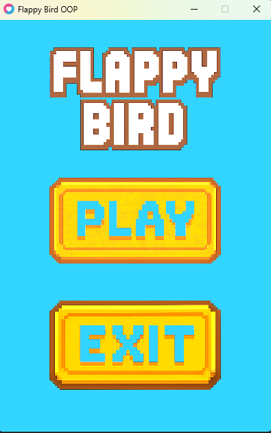

# 🎮 Flappy Bird OOP - Love2D

Un clon del clásico **Flappy Bird**, desarrollado con **Lua** y el framework **LÖVE2D**, utilizando un enfoque limpio de **programación orientada a objetos (OOP)**. Este proyecto está diseñado desde cero sin librerías externas, y con recursos visuales personalizados en estilo pixel art.

---

## 📸 Captura de Pantalla



---

## ✨ Características

- 🐤 Mecánica de juego fluida tipo Flappy Bird  
- 🧱 Obstáculos generados dinámicamente  
- 💥 Colisiones con tubos, suelo y techo  
- 🎨 Pixel art propio y estilo visual profesional  
- 🖼️ Menú principal con botones personalizados:  
  - Iniciar juego  
  - Salir  
- 🔄 Estados del juego:  
  - Menú  
  - Jugando  
  - Game Over  
- 🖱️ Controles intuitivos:  
  - Click del mouse o tecla **espacio** para saltar  

---

## 🗂️ Estructura del Proyecto

flappy-bird-oop/
│
├── assets/
│ └── images/
│ ├── background.png
│ ├── logo.png
│ ├── button_play.png
│ └── button_play_hover.png
│
├── classes/
│ ├── Bird.lua
│ ├── Pipe.lua
│ ├── PipePair.lua
│ └── Button.lua
│
├── states/
│ ├── MenuState.lua
│ ├── PlayState.lua
│ └── GameOverState.lua
│
├── conf.lua
├── main.lua
└── README.md

---

## 🚀 Requisitos

- [Love2D](https://love2d.org/) (versión 11.x recomendada)

---

## ▶️ Cómo Ejecutar

Abre una terminal en la carpeta del proyecto y corre:

```bash
love .
```

Si love no está en tu PATH, arrastra la carpeta del proyecto directamente al ejecutable de LÖVE2D.

## 🛠️ Tecnologías Usadas

- Lenguaje: Lua

- Motor: Love2D

- Paradigma: Programación orientada a objetos (con clases simples)

- Recursos visuales: Pixel art personalizado

## 📄 Licencia

Este proyecto está bajo la licencia MIT. Puedes usar el código como base para tus propios juegos o estudios.

## 🙌 Créditos

Desarrollado por [MiguelAngelCharrisCarmona].
Sprites y diseño gráfico hechos a mano para este proyecto.
