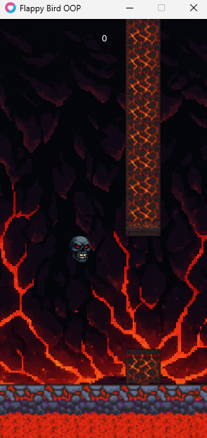
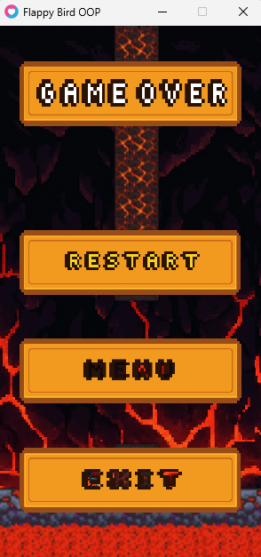

# 🔥 Infernal Flappy Bird

Un juego estilo Flappy Bird desarrollado en Lua con LÖVE 2D, con temática infernal y efectos visuales modernos.






## 🎮 Características

- **Gráficos personalizados** con temática infernal
- **Efectos de blur** en las tuberías usando shaders GLSL
- **Arquitectura modular** con patrón State Manager
- **Sistema de UI responsivo** con botones interactivos
- **Backgrounds animados** con parallax scrolling
- **Música de fondo** y efectos de sonido
- **Soporte para múltiples plataformas** (PC, móvil, web)

## 🚀 Instalación y Ejecución

### Requisitos
- **LÖVE 2D** (versión 11.0 o superior)
- Sistema operativo: Windows, macOS, Linux, Android, iOS

### Instalación
1. Descarga e instala [LÖVE 2D](https://love2d.org/)
2. Clona este repositorio:
   ```bash
   git clone https://github.com/tu-usuario/infernal-flappy-bird.git
   cd infernal-flappy-bird
   ```
3. Ejecuta el juego:
   ```bash
   love .
   ```

### Ejecución alternativa
- **Windows**: Arrastra la carpeta del proyecto sobre `love.exe`
- **macOS**: Arrastra la carpeta sobre la aplicación LÖVE
- **Linux**: `love /ruta/al/proyecto`

## 🎯 Controles

- **Espacio** / **Click izquierdo** / **Toque**: Hacer volar la calavera
- **Escape**: Salir del juego (en menú)
- **Ratón**: Navegar por los menús

## 🏗️ Arquitectura del Proyecto

```
src/
├── core/
│   ├── Assets.lua          # Gestión de recursos (Singleton)
│   └── Shaders.lua         # Shaders GLSL (Singleton)
├── entities/
│   ├── Pipe.lua           # Lógica de las tuberías
│   └── Skull.lua          # Lógica del jugador
├── states/
│   ├── GameState.lua      # Gestión global de estados
│   ├── MenuState.lua      # Estado del menú principal
│   ├── PlayState.lua      # Estado de juego
│   ├── GameOverState.lua  # Estado de game over
│   └── StateManager.lua   # Controlador de estados
└── ui/
    └── Button.lua         # Sistema de botones reutilizable

assets/
├── music/
│   └── soundtrack.mp3
├── shaders/
│   └── blur.frag         # Shader de blur para efectos
├── ui/
│   ├── background.png
│   ├── floor.png
│   ├── logo.png
│   ├── skull2.png
│   ├── infernal_pipe2.png
│   ├── gameover.png
│   └── button_*.png
└── examples/
    └── screenshot_menu.png
```

## 🔧 Características Técnicas

### Patrones de Diseño Implementados
- **Singleton Pattern**: Para Assets y Shaders
- **State Pattern**: Para manejo de estados del juego
- **Object Pooling**: Optimización de memoria para entidades
- **Component Pattern**: Separación de lógica y renderizado

### Optimizaciones
- **Lazy Loading**: Carga de recursos bajo demanda
- **Early Exit**: Optimización de loops y condicionales
- **Canvas Caching**: Reutilización de canvas para efectos
- **Batching**: Agrupación de llamadas de renderizado

### Efectos Visuales
- **Blur Shader**: Efectos de desenfoque en tuberías
- **Parallax Scrolling**: Fondos animados multicapa
- **Smooth Animations**: Interpolación de movimientos
- **Responsive UI**: Adaptación a diferentes resoluciones

## 🎨 Personalización

### Modificar Configuración del Juego
```lua
-- En PlayState.lua
self.pipeSpawnInterval = 2    -- Intervalo entre tuberías
self.skull.gravity = 1200     -- Gravedad del personaje
self.skull.lift = -400        -- Fuerza del salto
```

### Agregar Nuevos Efectos de Shader
```glsl
// En assets/shaders/
// Crear nuevos archivos .frag para efectos personalizados
```

### Cambiar Sprites
- Reemplaza los archivos PNG en `assets/ui/`
- Mantén las mismas dimensiones para compatibilidad
- Usa transparencia para sprites irregulares

## 🐛 Depuración

### Modo Debug
Agrega esta línea en `main.lua` para información de debug:
```lua
love.graphics.print("FPS: " .. love.timer.getFPS(), 10, 10)
```

### Problemas Comunes
- **Texturas no cargan**: Verifica las rutas en `Assets.lua`
- **Lag en móvil**: Reduce la calidad de los shaders
- **Audio no funciona**: Comprueba los códecs soportados

## 🚀 Roadmap

- [ ] Sistema de power-ups
- [ ] Múltiples personajes desbloqueables
- [ ] Leaderboard local
- [ ] Modo difícil con obstáculos adicionales
- [ ] Integración con servicios de puntuación online
- [ ] Port a otras plataformas (Steam, itch.io)

## 🤝 Contribuciones

Las contribuciones son bienvenidas. Por favor:

1. Haz fork del proyecto
2. Crea una rama para tu feature (`git checkout -b feature/nueva-caracteristica`)
3. Commit tus cambios (`git commit -am 'Agrega nueva característica'`)
4. Push a la rama (`git push origin feature/nueva-caracteristica`)
5. Abre un Pull Request

## 📄 Licencia

Este proyecto está bajo la Licencia MIT.

## 🎓 Créditos

- **Desarrollador**: [Miguel Angel Charris Carmona]
- **Engine**: LÖVE 2D
- **Inspiración**: Flappy Bird de Dong Nguyen
- **Assets**: Creación propia

## 📞 Contacto

- **GitHub**: [@Miguel249](https://github.com/Miguel249)
- **Email**: miguelangelcharriscarmona@gmail.com
- **LinkedIn**: [Miguel Angel Charris Carmona](https://www.linkedin.com/in/miguel-angel-charris-carmona-16915928b/)

---

⭐ Si te gustó el proyecto, ¡dale una estrella en GitHub!

#GameDev #Love2D #Lua #FlappyBird #IndieGame